# 前言

Shiro 是这一阶段比较火的攻击点，由于其适用范围广泛，每次爆发漏洞危害通常较大，本文将会梳理、总结和学习其相关漏洞。

# 简介

[Apache Shiro](https://shiro.apache.org/) 是一个 Java 安全框架，包括如下功能和特性：
- [Authentication](https://shiro.apache.org/authentication-features.html)：身份认证/登陆，验证用户是不是拥有相应的身份。在 Shiro 中，所有的操作都是基于当前正在执行的用户，这里称之为一个 `Subject`，在用户任意代码位置都可以轻易取到这个`Subject`。Shiro 支持数据源，称之为 `Realms`，可以利用其连接 LDAP\AD\JDBC 等安全数据源，并支持使用自定义的 `Realms`，并可以同时使用一个或多个 `Realms` 对一个用户进行认证，认证过程可以使用配置文件配置，无需修改代码。同时，Shiro 还支持 <font color="syan">RememberMe</font>，记住后下次访问就无需登录。
- [Authorization](https://shiro.apache.org/authorization-features.html)：授权，即权限验证，验证某个已认证的用户是否拥有某个权限。同样基于  `Subject`、支持多种 `Realms`。Shiro 支持 `Wildcard Permissions` ，也就是使用<font color="syan">通配符</font>来对权限验证进行建模，使权限配置简单易读。Shiro 支持基于 `Roles` 和基于 `Permissions` 两种方式的验证，可以根据需要进行使用。并且支持缓存产品的使用。
- [Session Manager](https://shiro.apache.org/session-management-features.html)：会话管理，用户登陆后就是一次会话，在没有退出之前，它的所有信息都在会话中。Shiro 中的一切（包括会话和会话管理的所有方面）都是基于接口的，并使用 POJO 实现，因此可以使用任何与 JavaBeans 兼容的配置格式（如 JSON、YAML、Spring XML 或类似机制）轻松配置所有会话组件。Session 支持缓存集群的方式；还支持事件侦听器，允许在会话的生命周期内侦听生命周期事件，以执行相关逻辑。Shiro Sessions 保留发起会话的主机的 IP 地址，因此可以根据用户位置来执行不同逻辑。Shiro 对 Web 支持实现了 `HttpSession` 类及相关全部 API。也可以在 SSO 中使用。
- [Cryptography](https://shiro.apache.org/cryptography-features.html)：加密，保护数据的安全性；Shiro 专注于使用公私钥对数据进行加密，以及对密码等数据进行不可逆的哈希。
- [Permissions](https://shiro.apache.org/permissions.html)：用户权限；Shiro 将所有的操作都抽象为 Permission，并默认使用 `Wildcard Permissions` 来进行匹配。Shiro 支持实例级别的权限控制校验，例如`domain:action:instance`。
- [Caching](https://shiro.apache.org/caching.html)：缓存，为了提高 Shiro 在业务中的性能表现。Shiro 的缓存支持基本上是一个封装的 API，由用户自行选择底层的缓存方式。缓存中有三个重要的接口 `CacheManager`/`Cache`/`CacheManagerAware` ，Shiro 提供了默认的 `MemoryConstrainedCacheManager` 等实现。


# 初识

在使用 Shiro 前，先来看一下其中几个关键组件，有助于后面更好的分析相关漏洞。

## SecurityManager

`org.apache.shiro.mgt.SecurityManager` 是 shiro 的一个核心接口，接口负责了一个 Subject 也就是“用户”的全部安全操作：
- 接口本身定义了 `createSubject`、`login`、`logout` 三个方法用来创建 Subject、登陆和退出。
- 扩展了 `org.apache.shiro.authc.Authenticator` 接口，提供了 `authenticate` 方法用来进行认证。
- 扩展了 `org.apache.shiro.authz.Authorizer`  接口，提供了对 Permission 和 Role 的校验方法。包括 `has/is/check` 相关命名的方法。
- 扩展了 `org.apache.shiro.session.mgt.SessionManager` 接口，提供了 `start`、`getSession` 方法用来创建可获取会话。

Shiro 为 SecurityManager 提供了一个包含了上述所有功能的默认实现类 `org.apache.shiro.mgt.DefaultSecurityManager`，中间继承了很多中间类，并逐层实现了相关的方法，继承关系如下图。

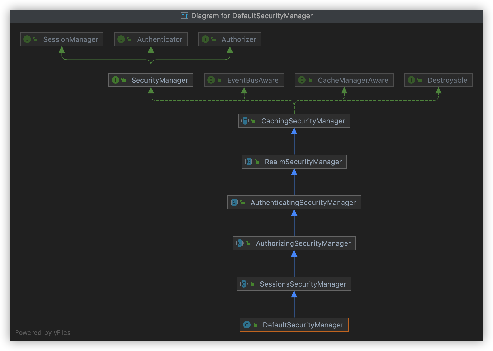

DefaultSecurityManager 中包含以下属性:
- `subjectFactory`：默认使用 DefaultSubjectFactory，用来创建具体 Subject 实现类。
- `subjectDAO`：默认使用 DefaultSubjectDAO，用于将 Subject 中最近信息保存到 Session 里面。
- `rememberMeManager`：用于提供 RememberMe 相关功能。
- `sessionManager`：默认使用 DefaultSessionManager，Session 相关操作会委托给这个类。
- `authorizer`：默认使用 ModularRealmAuthorizer，用来配置授权策略。
- `authenticator`：默认使用 ModularRealmAuthenticator，用来配置认证策略。
- `realm`：对认证和授权的配置，由用户自行配置，包括 CasRealm、JdbcRealm 等。
- `cacheManager`：缓存管理，由用户自行配置，在认证和授权时先经过，用来提升认证授权速度。

DefaultSecurityManager 还有一个子类，就是 `org.apache.shiro.web.mgt.DefaultWebSecurityManager`，这个类在 shiro-web 包中，是 Shiro 为 HTTP/SOAP 等 http 协议连接提供的实现类，这个类默认创建配置了 `org.apache.shiro.web.mgt.CookieRememberMeManager` 用来提供 RememberMe 相关功能。

## Subject

`org.apache.shiro.subject.Subject` 是一个接口，用来表示在 Shiro 中的一个用户。因为在太多组件中都使用了 `User` 的概念，所以 Shiro 故意避开了这个关键字，使用了 `Subject`。

Subject 接口同样提供了认证（login/logout）、授权（访问控制 has/is/check 方法）以及获取会话的能力。在应用程序中如果想要获取一个当前的 Subject，通常使用 `SecurityUtils.getSubject()` 方法即可。

单从方法的命名和覆盖的功能来看，Subject 提供了与 SecurityManager 非常近似的方法，用来执行相关权限校验操作。而实际上，Subject 接口在 core 包中的实现类 `org.apache.shiro.subject.support.DelegatingSubject` 本质上也就是一个 SecurityManager 的代理类。

DelegatingSubject 中保存了一个 transient 修饰的  SecurityManager  成员变量，在使用具体的校验方法时，实际上委托 SecurityManager 进行处理，如下图：

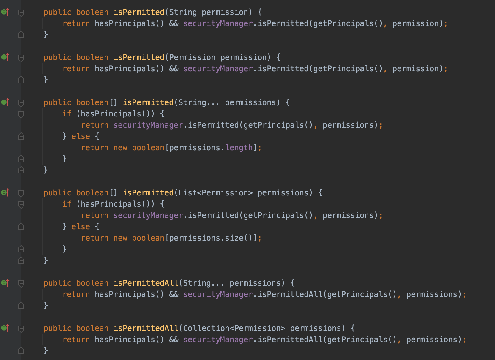

DelegatingSubject 中不会保存和维持一个用户的“状态（角色/权限）”，恰恰相反，每次它都依赖于底层的实现组件 SecurityManager 进行检查和校验，因此通常会要求 SecurityManager 的实现类来提供一些缓存机制。所以本质上，Subject 也是一种“无状态”的实现。

## Realm

Realm 翻译过来是“领域、王国”，这里可以将其理解以为一种“有界的范围”，实际上就是权限和角色的认定。

`org.apache.shiro.realm.Realm` 是 Shiro 中的一个接口，Shiro 通过 Realm 来访问指定应用的安全实体——用户、角色、权限等。一个 Realm 通常与一个数据源有 1 对 1 的对应关系，如关系型数据库、文件系统或者其他类似的资源。

因此，此接口的实现类，将使用特定于数据源的 API 来进行认证或授权，如 JDBC、文件IO、Hibernate/JPA 等等，官方将其解释为：特定于安全的 DAO 层。

在使用中，开发人员通常不会直接实现 Realm 接口，而是实现 Shiro 提供了一些相关功能的抽象类 AuthenticatingRealm/AuthorizingRealm，或者使用针对特定数据源提供的实现类如 JndiLdapRealm/JdbcRealm/PropertiesRealm/TextConfigurationRealm/IniRealm 等等。继承关系大概如下：

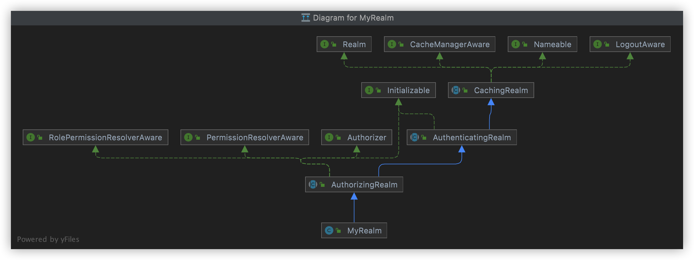

较多情况下，开发人员会自行实现 `AuthorizingRealm` 类，并重写 `doGetAuthorizationInfo`/`doGetAuthenticationInfo` 方法来自行实现自身的认证和授权逻辑。


## 小结

通过对以上三个组件的了解，一次认证及授权的校验流程就形成了：
1. 应用程序通过获取当前访问的 Subject（也就是用户），并调用其相应校验方法；
2. Subject 将校验委托给 SecurityManager 进行判断；
3. SecurityManager 会调用 Realm 来获取信息来判断用户对应的角色能否进行操作。


# 使用

本章来看一下该如何将 Shiro 安全框架集合在 web 应用中，官方文档 [Web Support](https://shiro.apache.org/web.html) 一章给出了一些使用方法，这里进行学习和测试。

## web.xml

在普通 web 项目中， Shiro 框架的注入是通过在 `web.xml` 中配置 Filter 的方式完成的。

在 Shiro 1.1 及之前的版本，通过配置 `IniShiroFilter` ，并在 `/WEB-INF/shiro.ini` 或 `classpath:shiro.ini` 中进行相应的权限配置。也可以指定配置文件路径，示例如下：

```xml
<filter>
    <filter-name>ShiroFilter</filter-name>
    <filter-class>org.apache.shiro.web.servlet.IniShiroFilter</filter-class>
    <init-param>
        <param-name>configPath</param-name>
        <param-value>/WEB-INF/anotherFile.ini</param-value>
    </init-param>
</filter>
```


在 Shiro 1.2 及之后的版本，可以进行如下配置：

```xml
<listener>
    <listener-class>org.apache.shiro.web.env.EnvironmentLoaderListener</listener-class>
</listener>

...

<filter>
    <filter-name>ShiroFilter</filter-name>
    <filter-class>org.apache.shiro.web.servlet.ShiroFilter</filter-class>
</filter>

<filter-mapping>
    <filter-name>ShiroFilter</filter-name>
    <url-pattern>/*</url-pattern>
</filter-mapping>
```

官方更推荐直接使用 `ShiroFilter` 类进行处理，并为 Web 应用程序配置了一个 Listener： `EnvironmentLoaderListener`。这是一个  `ServletContextListener` 的子类，会在初始化时将 WebEnvironment 的实现类注入到 ServletContext 中。


ShiroFilter 则使用 WebEnvironment 中的 WebSecurityManager 来作为当前 Shiro 上下文中的 SecurityManager。

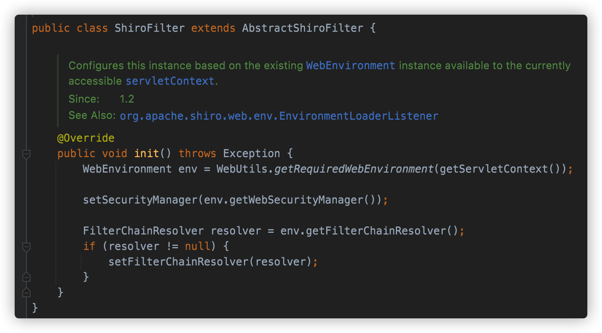

在 Filter 处理流程中，ShiroFilter 继承的 `doFilter` 调用 `AbstractShiroFilter#doFilterInternal` 方法，会使用保存的 SecurityManager 创建 Subject 对象。


并调用其 execute 方法执行后续的校验逻辑。

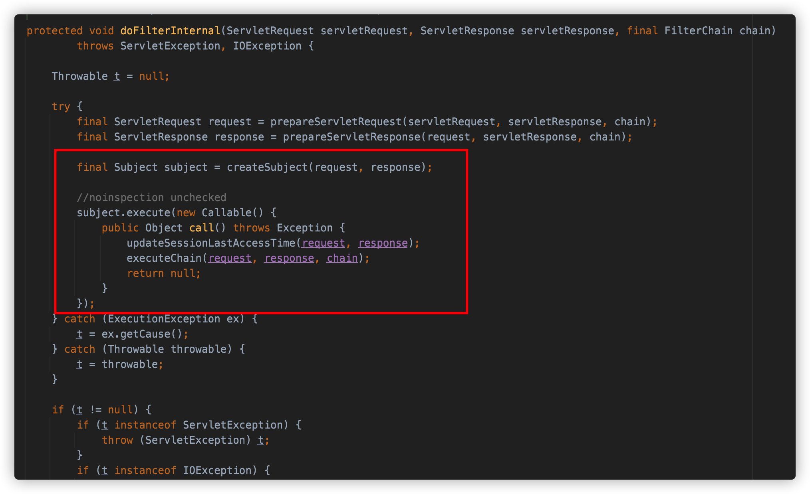

默认情况下，`EnvironmentLoaderListener` 创建的 WebEnvironment 的实例是 IniWebEnvironment，是基于 INI 格式的配置文件，如果不想使用这个格式，可以通过自实现一个 IniWebEnvironment 的子类，用来处理自己定义的配置文件格式，并在 `web.xml` 中进行如下配置：

```xml
<context-param>
    <param-name>shiroEnvironmentClass</param-name>
    <param-value>org.su18.shiro.web.config.WebEnvironment</param-value>
</context-param>
```

关于 INI 配置文件的配置，在官方文档[配置](https://shiro.apache.org/configuration.html)一章有详细描述，主要包括 `[main]`、`[users]`、`[roles]`、`[urls]` 四项配置。如果配置了 `[users]` 或 `[roles]`，则会自动创建 `org.apache.shiro.realm.text.IniRealm` 实例，并可以在 `[main]` 配置中进行调用及配置。

这里重点的配置，就在于 `[urls]` 这个配置项，详情参考相关官方配置[文档](https://shiro.apache.org/web.html#Web-%7B%7B%5Curls%5C%7D%7D)。大概可以配置成如下形式：

```ini
[urls]
/index = anon
/user/** = authc
/admin/** = authc, roles[administrator]
/audit/** = authc, perms["remote:invoke"]
```

简单来说，就是一个 Ant 风格的路径表达式与需要处理他的 Filter 之间的映射。Shiro 使用 `org.apache.shiro.web.filter.mgt.FilterChainManager` 自己维护一套 FilterChain 的机制，用来依次对多个 Filter 进行校验。

Shiro 默认提供了一些 Filter，名称及对应处理类如下表格，如果想深入理解某个 Filter 功能的具体实现，可以具体查看。

| Filter 名称       | 对应类                                                       |
| :---------------- | :----------------------------------------------------------- |
| anon              | [org.apache.shiro.web.filter.authc.AnonymousFilter](https://shiro.apache.org/static/current/apidocs/org/apache/shiro/web/filter/authc/AnonymousFilter.html) |
| authc             | [org.apache.shiro.web.filter.authc.FormAuthenticationFilter](https://shiro.apache.org/static/current/apidocs/org/apache/shiro/web/filter/authc/FormAuthenticationFilter.html) |
| authcBasic        | [org.apache.shiro.web.filter.authc.BasicHttpAuthenticationFilter](https://shiro.apache.org/static/current/apidocs/org/apache/shiro/web/filter/authc/BasicHttpAuthenticationFilter.html) |
| authcBearer       | [org.apache.shiro.web.filter.authc.BearerHttpAuthenticationFilter](https://shiro.apache.org/static/current/apidocs/org/apache/shiro/web/filter/authc/BearerHttpAuthenticationFilter.html) |
| invalidRequest    | [org.apache.shiro.web.filter.InvalidRequestFilter](https://shiro.apache.org/static/current/apidocs/org/apache/shiro/web/filter/InvalidRequestFilter.html) |
| logout            | [org.apache.shiro.web.filter.authc.LogoutFilter](https://shiro.apache.org/static/current/apidocs/org/apache/shiro/web/filter/authc/LogoutFilter.html) |
| noSessionCreation | [org.apache.shiro.web.filter.session.NoSessionCreationFilter](https://shiro.apache.org/static/current/apidocs/org/apache/shiro/web/filter/session/NoSessionCreationFilter.html) |
| perms             | [org.apache.shiro.web.filter.authz.PermissionsAuthorizationFilter](https://shiro.apache.org/static/current/apidocs/org/apache/shiro/web/filter/authz/PermissionsAuthorizationFilter.html) |
| port              | [org.apache.shiro.web.filter.authz.PortFilter](https://shiro.apache.org/static/current/apidocs/org/apache/shiro/web/filter/authz/PortFilter.html) |
| rest              | [org.apache.shiro.web.filter.authz.HttpMethodPermissionFilter](https://shiro.apache.org/static/current/apidocs/org/apache/shiro/web/filter/authz/HttpMethodPermissionFilter.html) |
| roles             | [org.apache.shiro.web.filter.authz.RolesAuthorizationFilter](https://shiro.apache.org/static/current/apidocs/org/apache/shiro/web/filter/authz/RolesAuthorizationFilter.html) |
| ssl               | [org.apache.shiro.web.filter.authz.SslFilter](https://shiro.apache.org/static/current/apidocs/org/apache/shiro/web/filter/authz/SslFilter.html) |
| user              | [org.apache.shiro.web.filter.authc.UserFilter](https://shiro.apache.org/static/current/apidocs/org/apache/shiro/web/filter/authc/UserFilter.html) |

在请求访问到达 ShiroFilter 后，会根据 request 的信息，调用 `org.apache.shiro.web.filter.mgt.PathMatchingFilterChainResolver#getChain` 方法匹配配置的 pathPattern 以及 requestURI，如果有匹配，则会添加一层 ProxiedFilterChain 代理。这里看到，如果 `pathMatches` 方法匹配，将会进行 return，因此配置的顺序也很重要。

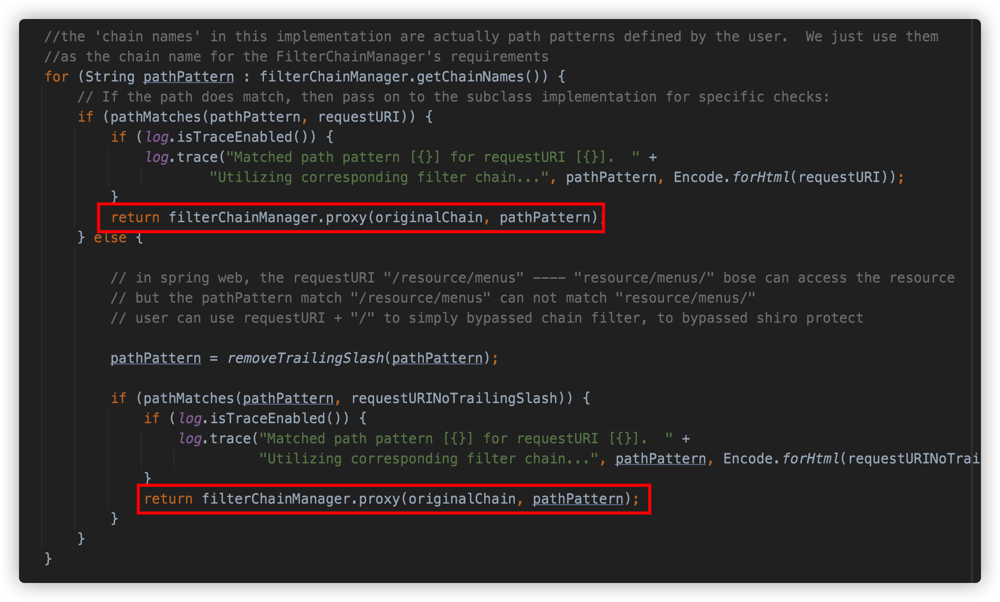

也就是说，Shiro 不会向 Servlet Context 中添加其他的 Filter，而是使用嵌套 ProxiedFilterChain 代理的方式扩展 FilterChain，并在自身 Filter 都处理结束之后继续执行原 FilterChain。

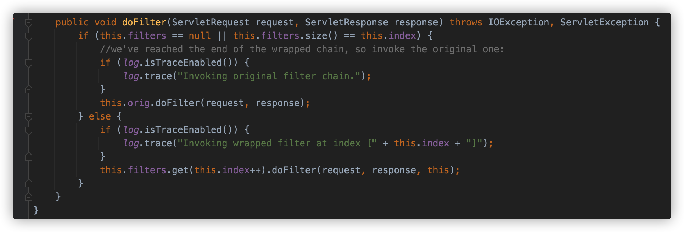


这里对于 Servlet Filter/FilterChain 以及 Shiro Filter/FilterChain 的区分描述可能不清晰，其实只需要自己下个断点跟一下流程就能明白了。

## Spring

在目前的环境下，越来越多的 Web 环境使用了 SpringBoot/SpringMVC 及相关生态，因此更多的时候会将 Shiro 集成配置在其中。为了应对此环境，Shiro 提供了 `shiro-spring` 包来进行配置。

在 Servlet 项目中，是通过在 `web.xml` 中配置了能匹配所有 URL 路径 `/*` 的 ShiroFilter，并由其执行后续逻辑。而在 Spring 生态下，由于 IoC 与 DI 的思想，通常把所有的 Filter 注册成为 Bean 交给 Spring 来管理。

此时如果想要将 Shiro 逻辑注入其中，就用到了关键类：`ShiroFilterFactoryBean`。这是 Shiro 为 Spring 生态提供的工厂类，由它在 spring 中承担了之前 ShiroFilter 的角色。内部类 SpringShiroFilter 继承了 AbstractShiroFilter，实现了类似的逻辑。 

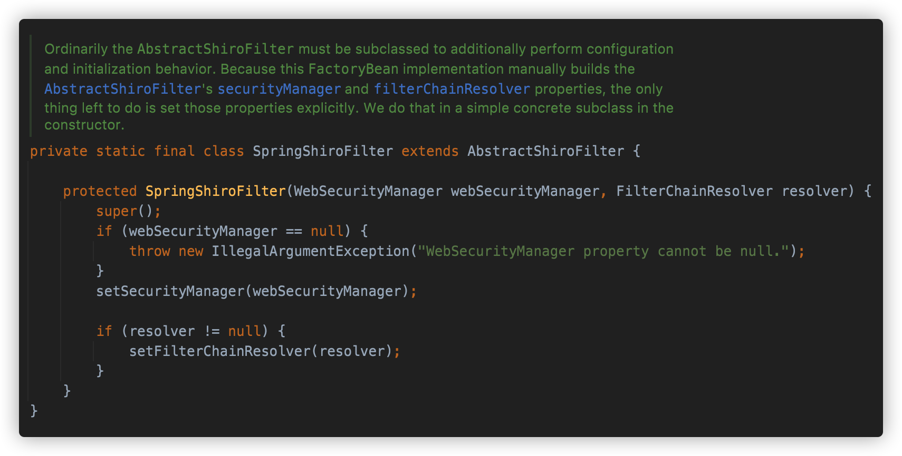

可以结合 `spring-web` 包中的 DelegatingFilterProxy 配置使用，其作用就是一个 filter 的代理，被它代理的 filter 将由 spring 来管理其生命周期。

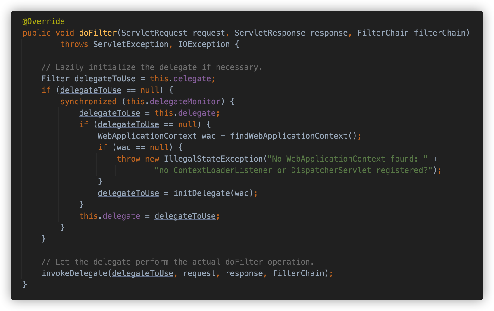

ShiroFilterFactoryBean 还是 BeanPostProcessor 的子类，实现了对于 Filter 子类自动发现和处理的技术，所以我们可以通过配置 ShiroFilterFactoryBean 的方式来注册 SpringShiroFilter。

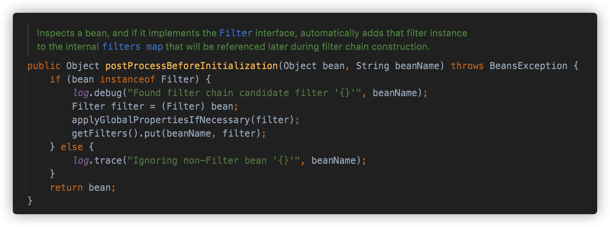

其他的配置也可以全部交由 Spring 管理，我们只需要对 ShiroFilterFactoryBean 进行配置即可，简单的示例代码如下：

```java
/**
 * @author su18
 */
@Configuration
public class ShiroConfig {

	@Bean
	MyRealm myRealm() {
		return new MyRealm();
	}

	@Bean
	RememberMeManager cookieRememberMeManager() {
		return new CookieRememberMeManager();
	}


	@Bean
	SecurityManager securityManager(MyRealm myRealm, RememberMeManager cookieRememberMeManager) {
		DefaultWebSecurityManager manager = new DefaultWebSecurityManager();
		manager.setRealm((Realm) myRealm);
		manager.setRememberMeManager(cookieRememberMeManager);
		return manager;
	}

	@Bean(name = {"shiroFilter"})
	ShiroFilterFactoryBean shiroFilterFactoryBean(SecurityManager securityManager) {
		ShiroFilterFactoryBean bean = new ShiroFilterFactoryBean();
		bean.setSecurityManager(securityManager);
		bean.setLoginUrl("/index/login");
		bean.setUnauthorizedUrl("/index/unauth");
		LinkedHashMap<String, String> map = new LinkedHashMap<String, String>();
		map.put("/index/user", "authc");
		map.put("/index/**", "anon");
		map.put("/audit/**", "authc, perms[\"audit:list\"]");
		map.put("/admin/**", "authc, roles[admin]");
		map.put("/logout", "logout");
		bean.setFilterChainDefinitionMap(map);
		return bean;
	}
}
```


# 安全漏洞

由于 Shiro 本身作为一个安全校验框架，所以其安全漏洞包含自身存在的安全问题，也包含能导致其安全校验失效的相关漏洞。

根据官方网站上的漏洞[通报](https://shiro.apache.org/security-reports.html)，shiro 在历史上共通报了 11 个 CVE，其中包含认证绕过、反序列化等漏洞类型，接下来我们来依次学习。


## CVE-2010-3863

### 漏洞信息

| 漏洞信息   | 详情 |
| :---------------- | :------------------------------- |
| 漏洞编号   |  [CVE-2010-3863](https://cve.mitre.org/cgi-bin/cvename.cgi?name=CVE-2010-3863) / [CNVD-2010-2715](https://www.cnvd.org.cn/flaw/show/CNVD-2010-2715)    |
| 影响版本   |  shiro < 1.1.0 & JSecurity 0.9.x  |
| 漏洞描述   |  Shiro 在对请求路径与 shiro.ini 配置文件配置的 AntPath 进行对比前<br>未进行路径标准化，导致使用时可能绕过权限校验  |
| 漏洞关键字 |    /./ \| 路径标准化   |
| 漏洞补丁 |    [Commit-ab82949](https://github.com/apache/shiro/commit/ab8294940a19743583d91f0c7e29b405d197cc34)    |
| 相关链接   |   [https://vulners.com/nessus/SHIRO_SLASHDOT_BYPASS.NASL](https://vulners.com/nessus/SHIRO_SLASHDOT_BYPASS.NASL)<br>[https://marc.info/?l=bugtraq&m=128880520013694&w=2](https://marc.info/?l=bugtraq&m=128880520013694&w=2)   |


### 漏洞详解

之前提到过，Shiro 使用 `PathMatchingFilterChainResolver#getChain` 方法获取和调用要执行的 Filter，逻辑如下：

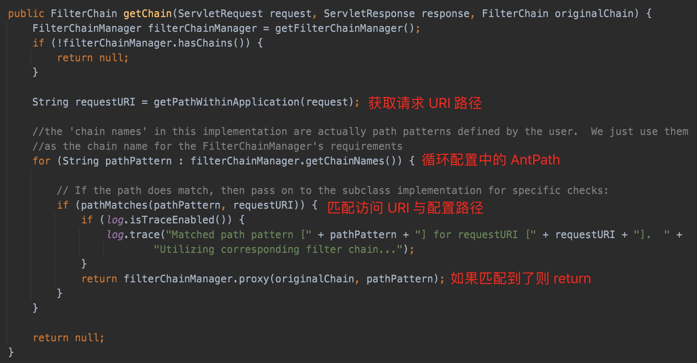

`getPathWithinApplication()` 方法调用 `WebUtils.getPathWithinApplication()` 方法，用来获取请求路径。通过如下逻辑可看到，方法获取 Context 路径以及 URI 路径，然后使用字符串截取的方式去掉 Context 路径。

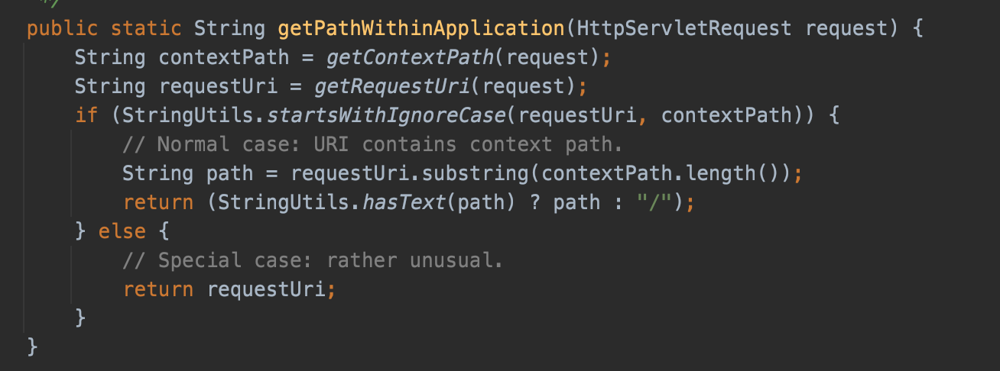

获取 URI 路径的方法 `getRequestUri()` 获取 `javax.servlet.include.request_uri` 的值，并调用 `decodeAndCleanUriString()` 处理。


`decodeAndCleanUriString()` 是 URL Decode 及针对 JBoss/Jetty 等中间件在 url 处添加 `;jsessionid` 之类的字符串的适配，对 `;` 进行了截取。

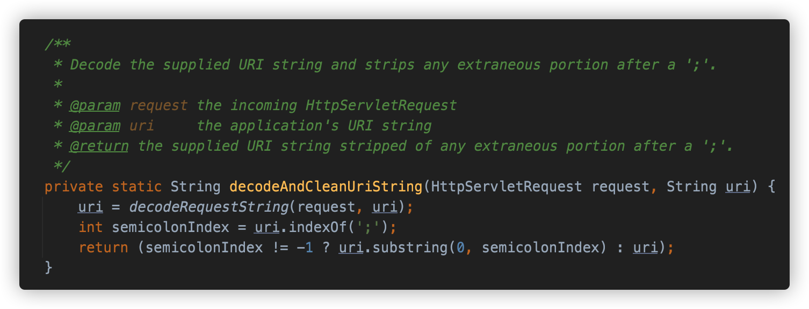

处理之后的请求 URL 将会使用 `AntPathMatcher#doMatch` 进行匹配尝试。

流程梳理到这里就出现了一个重大的问题：在匹配之前，没有进行标准化路径处理，导致 URI 中如果出现一些特殊的字符，就可能绕过安全校验。比如如下配置：

```ini
[urls]
/user/** = authc
/admin/list = authc, roles[admin]
/admin/** = authc
/audit/** = authc, perms["audit:list"]
/** = anon
```

在上面的配置中，为了一些有指定权限的需求的接口进行了配置，并为其他全部的 URL `/**`  设置了 `anno` 的权限。在这种配置下就会产生校验绕过的风险。

正常访问：`/audit`，会由于需要认证和权限被 Shiro 的 Filter 拦截并跳转至登录 URL。


访问 `/./audit`，由于其不能与配置文件匹配，导致进入了 `/**` 的匹配范围，导致可以越权访问。


### 漏洞修复

Shiro 在 [ab82949](https://github.com/apache/shiro/commit/ab8294940a19743583d91f0c7e29b405d197cc34) 更新中添加了标准化路径函数。


对 `/`、`//`、`/./`、`/../` 等进行了处理。


## CVE-2014-0074

### 漏洞信息

| 漏洞信息   | 详情 |
| :---------------- | :------------------------- |
| 漏洞编号   |  [CVE-2014-0074](https://cve.mitre.org/cgi-bin/cvename.cgi?name=CVE-2014-0074) / [CNVD-2014-03861](https://www.cnvd.org.cn/flaw/show/CNVD-2014-03861) / [SHIRO-460](https://issues.apache.org/jira/browse/SHIRO-460)  |
| 影响版本   |  shiro 1.x < 1.2.3  |
| 漏洞描述   |  当程序使用LDAP服务器并启用非身份验证绑定时，远程攻击者可借助<br>空的用户名或密码利用该漏洞绕过身份验证。  |
| 漏洞关键字 |    ldap \| 绕过 \| 空密码 \| 空用户名 \| 匿名  |
| 漏洞补丁 |     [Commit-f988846](https://github.com/apache/shiro/commit/f988846207f98c98ff24213ee9063798ea5d9b6c)   |
| 相关链接   |  [https://stackoverflow.com/questions/21391572/shiro-authenticates...in-ldap](https://stackoverflow.com/questions/21391572/shiro-authenticates-non-existent-user-in-ldap)<br>[https://www.openldap.org/doc/admin24/security.html](https://www.openldap.org/doc/admin24/security.html) |


### 漏洞详解

首先来复现一下这个漏洞，搭建一个 ldap 服务器用于认证，这里作者在测试时尝试使用了 openldap 的 docker 环境：

```sh
docker pull osixia/openldap
docker run -p 389:389 -p 636:636 --name openldap --network bridge  \
--hostname openldap-host --env LDAP_ORGANISATION="su18" \
 --env LDAP_DOMAIN="su18.org" --env LDAP_ADMIN_PASSWORD="123456" \
  --detach osixia/openldap
```

以及 mac 自带的 openldap 环境，

```sh
sudo /usr/libexec/slapd -f /etc/openldap/slapd.conf -d 255
```

启动后随意向其中添加一个用户。`shiro.ini` 采用如下配置：

```ini
[main]
# 登陆地址
authc.loginUrl = /login

# ldap
ldapContextFactory = org.apache.shiro.realm.ldap.JndiLdapContextFactory
ldapContextFactory.url = ldap://127.0.0.1:389/

# realm
adRealm = org.apache.shiro.realm.activedirectory.ActiveDirectoryRealm
adRealm.ldapContextFactory = $ldapContextFactory
adRealm.searchBase = "cn=config,dc=su18,dc=org"


[urls]
/index = anon
/login = anon
/logout = logout
/** = authc
```

按照 BUG 提交者的配置，设置 Realm 为 ActiveDirectoryRealm，并指定其 ldapContextFactory 为 JndiLdapContextFactory。BUG 提交者一共提出了两个场景，一个是空账户加空密码绕过，一个是空账户加任意密码绕过。

根据官方通告是 ldap 服务器在 enabled 了 unauthenticated bind  之后会受到影响，这里来复现一下。

#### 场景 1

场景 1 是当 ldap 服务器允许匿名访问（Anonymous）时，可以使用空用户和空密码登录，复现如下。

首先访问 `/login` 接口登陆，在我搭建的测试环境中，访问链接：[http://localhost:8080/login?username=cn=test,dc=su18,dc=org&password=test](http://localhost:8080/login?username=cn=test,dc=su18,dc=org&password=test)，成功登陆后，页面跳转至 `/user`，显示认证后才会看到的页面，并打印出了当前用户的 principal。


此时一切认证状态正常。随后访问 `/logout` 接口登出，页面跳转回 `/login` 登陆页面。


接下来就是见证奇迹的时刻，再次尝试登陆，使用空用户名及空密码，访问链接：[http://localhost:8080/login?username=&password=](http://localhost:8080/login?username=&password=)，发现成功认证，页面跳转至 `/user`，可以访问到需要认证才展示的页面，而 `SecurityUtils.getSubject().getPrincipal()` 的结果为 `""`。


其他需要认证的页面也可以直接访问，如 `/admin`。


#### 场景 2

首先修改 openldap 的配置文件开启未授权 bind，如下图配置：

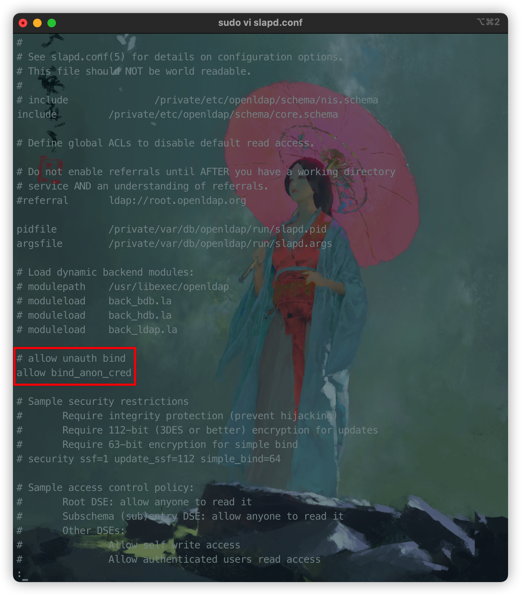

接下来使用空用户名+任意密码的组合尝试登陆，访问链接：[http://localhost:8080/login?username=&password=123](http://localhost:8080/login?username=&password=123)，

发现同样会成功登陆，页面跳转至 `/user`，同样 principal 为空字符串。


这个漏洞的调用我从头到尾跟了好几次，但这里并不打算列举出来调用链，或分析判断逻辑，因为从两个场景来说，漏洞本质上应该是 ldap 的配置问题，并不应作为 Shiro 的安全漏洞被列举出来，因为不同机制的实现肯定有差异。但官方还是出了更新补丁，甚至给了 CVE，很让人费解。

但这还不是最让人费解的，最让人费解的是这个 CVE 的修复补丁逻辑。

### 漏洞修复

Shiro 在 [f988846](https://github.com/apache/shiro/commit/f988846207f98c98ff24213ee9063798ea5d9b6c) 中针对此漏洞进行了修复，实际上，整个 1.2.3 版本的更新就是针对这个漏洞。

官方在 `DefaultLdapContextFactory` 和 `JndiLdapContextFactory` 中均加入了 `validateAuthenticationInfo` 方法用来校验 principal 和 credential 为空的情况。可以看到这里的逻辑是只有 principal 不为空的情况下，才会对 credential 进行校验。

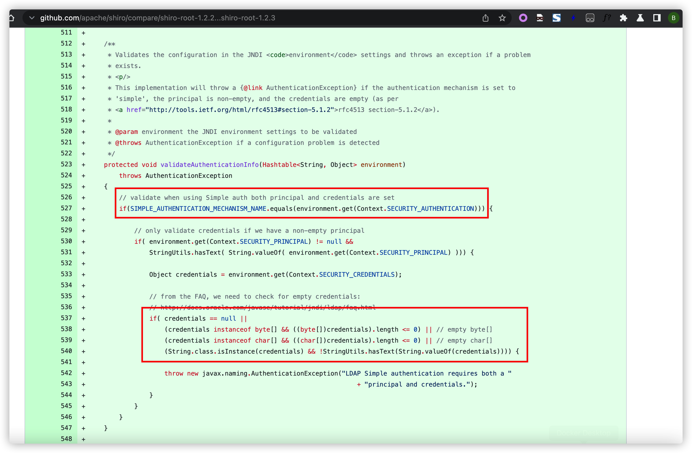

并在 `getLdapContext` 方法创建 InitialLdapContext 前执行了校验，如果为空，将会抛出异常。


修复看到这里就让人有些摸不到头脑，正常来讲，本次漏洞的修复应该针对 BUG 提交者提到的空用户名绕过的安全问题，也就是如下两种场景：
- ldap unauthenticated bind enabled 的情况下，可以使用空用户名+任意密码进行认证。
- ldap allow anonymous 的情况下，可以空用户名+空密码的匿名访问进行认证。

这两种均是 Shiro 判断机制和 ldap 配置之间冲突导致的问题，但是 shiro 并未修复这两种情况，而修复的是有用户名但是密码是空的情况，这种机制在 ldap 中不叫 unauthenticated，实际叫做 <font color="Green">Pass-Through Authentication</font>。LDAP 服务器在开启了相关配置后，允许通过用户名+空密码/错误密码的方式来经过认证。

很显然，Shiro 是针对这种情况进行了修复，可能是对提交的 BUG 理解有误，但它确实修复了一项漏洞，只不过这修复的和提交的 BUG 关系并不大。所以...你懂得。