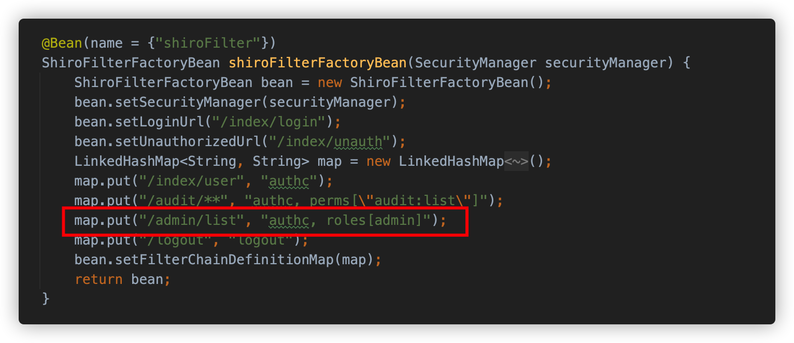
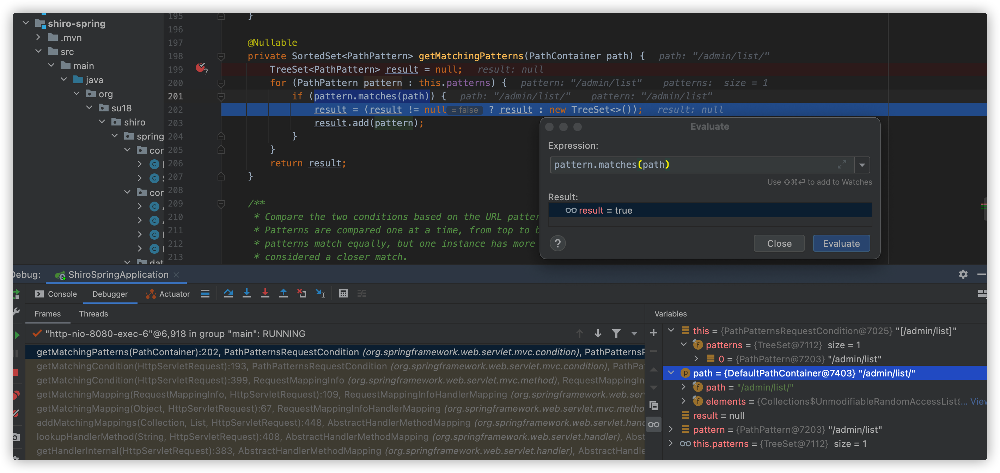
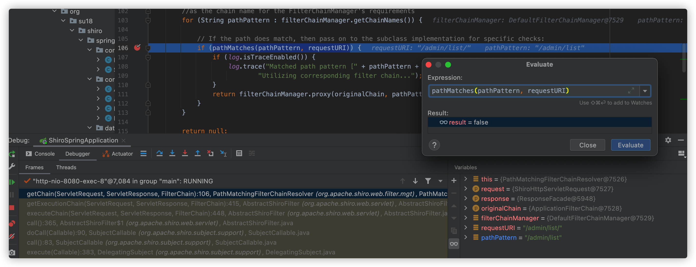
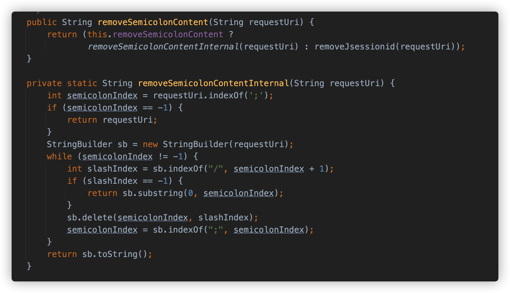
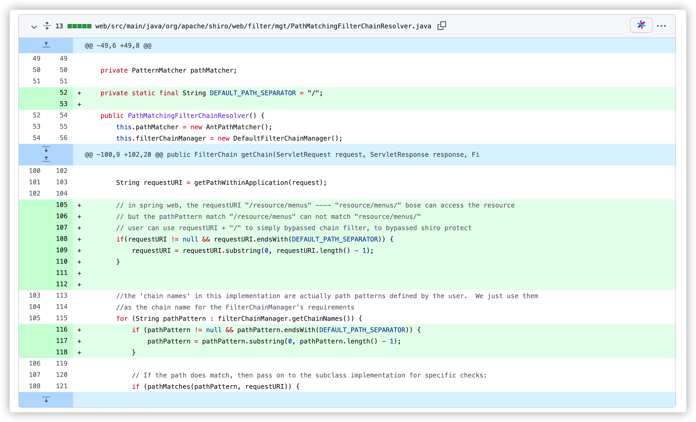
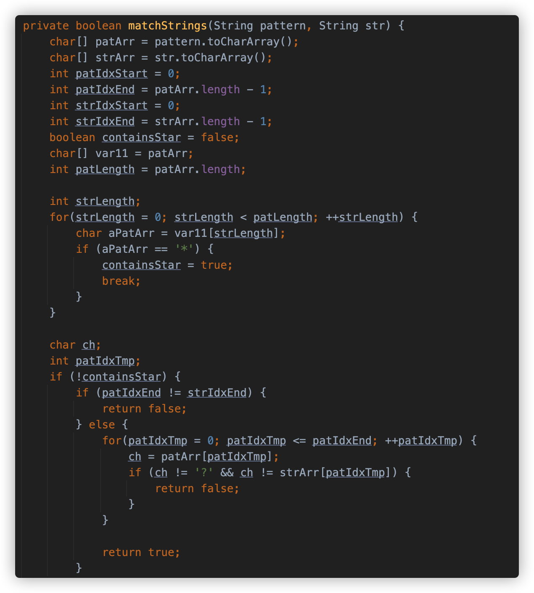
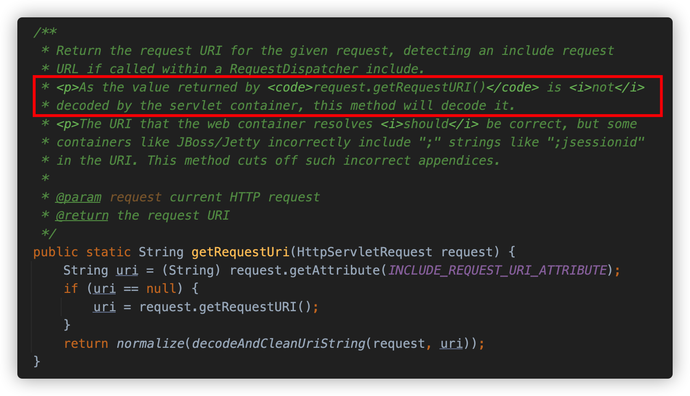
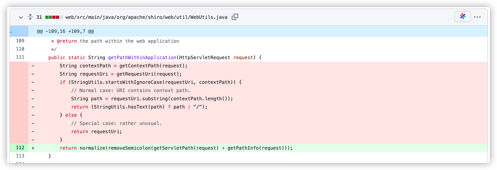

# CVE-2020-1957

## 漏洞信息

| 漏洞信息   | 详情 |
| :---------------- | :------------------------- |
| 漏洞编号   |  [CVE-2020-1957](https://cve.mitre.org/cgi-bin/cvename.cgi?name=CVE-2020-1957) / [CNVD-2020-20984](https://www.cnvd.org.cn/flaw/show/CNVD-2020-20984) / [SHIRO-682](https://issues.apache.org/jira/browse/SHIRO-682)  |
| 影响版本   |  shiro  < 1.5.2  |
| 漏洞描述   |  Spring Boot 中使用 Apache Shiro 进行身份验证、权限控制时，可以精心构造恶意的URL<br>利用 Shiro 和 SpringBoot 对 URL 的处理的差异化，可以绕过 Shiro 对 SpringBoot 中的<br>Servlet 的权限控制，越权并实现未授权访问。  |
| 漏洞关键字 |    SpringBoot \| 差异化处理 \| / \| 绕过  |
| 漏洞补丁 |    [Commit-589f10d](https://github.com/apache/shiro/commit/589f10d40414a815dbcaf1f1500a51f41258ef70)  && [Commit-9762f97](https://github.com/apache/shiro/commit/9762f97926ba99ac0d958e088cae3be8b657948d) && [Commit-3708d79](https://github.com/apache/shiro/commit/3708d7907016bf2fa12691dff6ff0def1249b8ce)    |
| 相关链接   |  [SHIRO-742](https://issues.apache.org/jira/browse/SHIRO-742)<br> [https://www.openwall.com/lists/oss-security/2020/03/23/2](https://www.openwall.com/lists/oss-security/2020/03/23/2)<br>[CVE-2020-2957](https://cve.mitre.org/cgi-bin/cvename.cgi?name=CVE-2020-2957)   -> ? |


## 漏洞详解

本 CVE 其实包含了几个版本的修复与绕过过程，这也导致了在网上搜索本 CVE 时可能得到不同 POC 的漏洞复现文章，这里就从头开始说一下。

### SHIRO-682

本漏洞起源于 [SHIRO-682](https://issues.apache.org/jira/browse/SHIRO-682)，Issues 描述了在 SpingWeb 中处理 requestURI 与 shiro 中匹配鉴权路径差异导致的绕过问题：在 Spring 中，`/resource/menus` 与 `/resource/menus/` 都可以访问资源，但是在 shiro 中，这两个路径是成功匹配的，所以在 Spring 集成 shiro 时，只需要在访问路径后添加 "/" 就存在绕过权限校验的可能。

接下来简单复现一下，如下图配置请求路径 "/admin/list" 需要认证和授权。



正常访问会提示跳转到登陆页面。


此时在请求路径后添加 "/"，即 "/admin/list/"，即可绕过权限校验


这个漏洞的原理在前面 Issues 的描述中已经说的很明白了，其实就是 spring 在分发请求时，会从 `DispatcherServlet#handlerMappings` 找到能匹配路径的 Handler，会遍历匹配路径，负责匹配的 `PathPattern#match` 方法对 "/admin/list/" 和 "/admin/list" 的匹配会返回 true。



而 shiro 用来匹配的 `PathMatchingFilterChainResolver#pathMatches` 则会返回 false。



这一差异导致了校验的绕过。

### 绕过

除了上面的漏洞，本 CVE 通报版本号内还存在一个另一个绕过。利用的是 shiro 和 spring 对 url 中的 ";" 处理的差别来绕过校验。

还是先来复现一下，直接扔截图。


很显然，绕过的原理就是访问 `/aaaadawdadaws;/..;wdadwadadw/;awdwadwa/audit/list` 这个请求的时候会被 shiro 和 spring 解析成不同的结果。

先来看下 shiro，之前提到过，shiro 会用自己处理过的 RequestURI 和配置的路径进行匹配，具体的方法就是 `WebUtils#getRequestUri`，方法先调用 `decodeAndCleanUriString` 方法处理请求路径，再调用 normalize 方法标准化路径。`decodeAndCleanUriString` 方法逻辑如下，可以看到，对 URL 中存在 ";" 的处理是直接截断后面的内容。


那 Spring 是怎么处理的呢？方法是 `UrlPathHelper#decodeAndCleanUriString` ，方法名也叫 `decodeAndCleanUriString`，你说巧不巧？其实一点也不巧，这分明就是 shiro 抄 spring 的作业。

方法里一次执行了 3 个动作：removeSemicolonContent 移除分号，decodeRequestString 解码，getSanitizedPath 清理路径，具体描述如下图：


其中出现差异的点就在于 `UrlPathHelper#removeSemicolonContent` ，逻辑如下图：



可以看到，spring 处理了每个 / / 之间的分号，均把 ";" 及之后的内容截取掉了。所以当请求 `/aaaadawdadaws;/..;wdadwadadw/;awdwadwa/audit/list` 进入到 `UrlPathHelper#decodeAndCleanUriString` 方法时，会逐渐被处理：
- removeSemicolonContent："/aaaadawdadaws/..//audit/list"
- decodeRequestString："/aaaadawdadaws/..//audit/list"
- getSanitizedPath："/aaaadawdadaws/../audit/list"

这样再标准化就会成为正常的 "/audit/list"。

这种思路是哪里来的呢？其实又是抄了 Tomcat 的处理思想，处理逻辑位于 `org.apache.catalina.connector.CoyoteAdapter#parsePathParameters` 如下图


也就说，在 Tomcat 的实现下，对于访问 URL 为 "/aaaadawdadaws;/..;wdadwadadw/;awdwadwa/audit/list"  的请求，使用 `request.getServletPath()` 就会返回 "/audit/list"。

而由于 spring 内嵌 tomcat ，又在处理时借鉴了它的思路，所以导致 `UrlPathHelper#getPathWithinServletMapping` 方法其实无论如何都会返回经过上述处理逻辑过后的路径，也就是 "/audit/list"。

了解了这个处理机制后，这个路径就可以被花里胡哨的改为：

```http
http://127.0.0.1:8080/123;/..;345/;../.;/su18/..;/;/;///////;/;/;awdwadwa/audit/list
```
依然可以绕过校验：


经测试，上面这个 payload 只能在较低版本的 Spring Boot 上使用。为什么呢？直接引用
 Ruil1n 师傅的[原文](http://rui0.cn/archives/1643):

> 当 Spring Boot 版本在小于等于 2.3.0.RELEASE 的情况下，alwaysUseFullPath 为默认值 false，这会使得其获取 ServletPath ，所以在路由匹配时相当于会进行路径标准化包括对 %2e 解码以及处理跨目录，这可能导致身份验证绕过。而反过来由于高版本将 alwaysUseFullPath 自动配置成了 true 从而开启全路径，又可能导致一些安全问题。

针对这方面的内容，截止至本文发出前，先知上有师傅发出了[tomcat容器url解析特性研究](https://xz.aliyun.com/t/10799)，对其中的相关内容进行了详述，可移步观看。

在高版本上不处理跨目录，就只能借助 shiro 一些配置问题尝试绕过：比如应用程序配置了访问路径 "/audit/**" 为 anon，但是指定了其中的一个 "/audit/list" 为 authc。这时在不跳目录的情况下，可以使用如下请求绕过：

```http
http://127.0.0.1:8080/audit//;aaaa/;...///////;/;/;awdwadwa/list
```


## 漏洞修复

首先是针对  [SHIRO-682](https://issues.apache.org/jira/browse/SHIRO-682) 的修复，共提交了两次，第一次为 [Commit-589f10d](https://github.com/apache/shiro/commit/589f10d40414a815dbcaf1f1500a51f41258ef70) ，如下图，可以看到是在 `PathMatchingFilter#pathsMatch` 方法中添加了对访问路径后缀为 "/" 的支持。


同时在 `PathMatchingFilterChainResolver#getChain` 也添加了同样的逻辑。



第二次是 [Commit-9762f97](https://github.com/apache/shiro/commit/9762f97926ba99ac0d958e088cae3be8b657948d)，是修复由于上一次提交，导致访问路径为 "/" 时抛出的异常。可以看到除了 `endsWith` 还添加了 `equals` 的判断。


然后是对使用 ";" 绕过的修复 [Commit-3708d79](https://github.com/apache/shiro/commit/3708d7907016bf2fa12691dff6ff0def1249b8ce)， 可以看到 shiro 不再使用 `request.getRequestURI()` 来获取用户妖魔鬼怪的请求路径，而是使用 `request.getContextPath()`、`request.getServletPath()`、`request.getPathInfo()` 进行拼接，直接获取中间件处理后的内容。


# CVE-2020-11989

## 漏洞信息

| 漏洞信息   | 详情 |
| :---------------- | :------------------------- |
| 漏洞编号   |  [CVE-2020-11989](https://cve.mitre.org/cgi-bin/cvename.cgi?name=CVE-2020-11989) / [SHIRO-782](https://issues.apache.org/jira/browse/SHIRO-782)  |
| 影响版本   |  shiro  < 1.5.3  |
| 漏洞描述   |  由安全研究员 Ruilin 以及淚笑发现在 Apache Shiro 1.5.3 之前的版本，<br>将 Apache Shiro 与 Spring 动态控制器一起使用时，特制请求可能会导致身份验证绕过。  |
| 漏洞关键字 |    Spring \| 双重编码 \| %25%32%66 \| 绕过 \| context-path \| /;/  |
| 漏洞补丁 |    [Commit-01887f6](https://github.com/apache/shiro/commit/01887f645f92d276bbaf7dc644ad28ed4e82ef02)  |
| 相关链接   |  [https://xlab.tencent.com/cn/2020/06/30/xlab-20-002/](https://xlab.tencent.com/cn/2020/06/30/xlab-20-002/)<br>[https://mp.weixin.qq.com/s/yb6Tb7zSTKKmBlcNVz0MBA](https://mp.weixin.qq.com/s/yb6Tb7zSTKKmBlcNVz0MBA) |


## 漏洞详解

此版本漏洞依旧是存在了两种绕过的手段，也分别由报送漏洞的腾讯玄武实验室和边界无限给出了漏洞利用的细节，这里还是依次来看一下。

### AntPathMatcher 绕过

根据腾讯玄武实验室官方给出的漏洞细节文章，本漏洞是需要几个利用条件的，接下来看一下具体的细节。

Shiro 支持 [Ant](https://ant.apache.org/) 风格的路径表达式配置。ANT 通配符有 3 种，如下表：

| 通配符 |          说明           |
| :----: | :---------------------: |
|   ?    |     匹配任何单字符      |
|   \*    | 匹配0或者任意数量的字符 |
|   \*\*   |   匹配0或者更多的目录   |

在之前的测试和使用中，常见的就是 `/**` 之类的配置，匹配路径下的全部访问请求，包括子目录及后面的请求，如：`/admin/**` 可以匹配 `/admin/list` 以及 `/admin/get/id/2` 等请求。

另外一个类似的配置是 `/*` ，单个 `*` 不能跨目录，只能在两个 `/` 之间匹配任意数量的字符，如 `/admin/*`  可以匹配 `/admin/list` 但是不能匹配 `/admin/get/id/2`。

Shiro 对于 Ant 风格路径表达式解析的支持位于 `AntPathMatcher#doMatch` 方法中，这里简单说一下其中的逻辑：

首先判断配置的表达式 pattern 和访问路径 path 起始是否均为 `/` 或均不是，如果不同则直接返回 false。


然后将 pattern 和 path 均切分为 String 类型的数组。


然后开始循环判断 pattern 和 path 对应位置的配置和路径是否有匹配，判断使用 `AntPathMatcher#matchStrings` 方法。


`AntPathMatcher#matchStrings` 方法又把字符拆分成 char 数组，来进行匹配尝试，并支持 `*` 以及 `?` 类型的通配符的匹配。



本次漏洞涉及到的配置则是使用 `*` 配置。再再次重温一下 shiro 的处理逻辑：

`WebUtils#getRequestUri` 方法使用 `request.getContextPath()/request.getServletPath()/request.getPathInfo()` 获取用户请求路径，然后调用 `decodeAndCleanUriString` 方法解码并取出 `;` 之后的内容，然后调用 normalize 标准化路径。


`decodeAndCleanUriString` 方法逻辑之前贴过，这里再贴一次。


而漏洞就出在此逻辑处，各位看官集中注意力，我来描述一下：
- 以前的 shiro 使用 `request.getRequestURI()` 获取用户请求路径，并自行处理，此时 shiro 默认Servlet 容器（中间件）不会对路径进行 URL 解码操作，通过其注释可以看到；

- 在 1.5.2 版本的 shiro 更新中，为了修复 CVE-2020-1957 ，将  `request.getRequestURI()`  置换为了 `valueOrEmpty(request.getContextPath()) + "/" + valueOrEmpty(request.getServletPath()) + valueOrEmpty(request.getPathInfo());`，而对于 `request.getContextPath()`  以及 `request.getPathInfo()`，以 Tomcat 为例的中间件是会对其进行 URL 解码操作的，此时 shiro 再进行 `decodeAndCleanUriString`，就相当于进行了两次的  URL 解码，而与之后的 Spring 的相关处理产生了差异。

这其中细节，可以查看 mi1k7ea 师傅发表在先知上的[文章](https://xz.aliyun.com/t/7544)，我这里截取其中的一小段。


至此已经发现了 shiro 中的路径处理差异问题，由于 shiro 会二次解码路径，因此 `%25%32%66` 将会被 shiro 解码为 `/`，而如果只解码一次， `%25%32%66` 只会被处理成 `%2f`。

此时如果使用了单个 "\*" 的通配符，将产生差异化问题，例如如下配置，配置了 `/audit/*`：


此时访问 `/audit/list`，`/audit/aaa` 之类的请求，都会被 shiro 拦截，需要进行权限校验。

但是如果访问 `/audit/aa%25%32%66a`，在 shiro 处理时，会将其处理为 `/audit/aa/a`，此路径并不能被 `/audit/*` 配置项匹配到，因此会绕过 shiro 校验。而在后续 spring 逻辑中会处理成 `/audit/aa%2fa`，可能会绕过请求。

找到了差异点，接下来就要找场景了，Ruil1n 师傅找到了当 Spring 在参数中使用 `PathVariable` 注解从 RequestMapping 中的占位符中取数据的场景，可以满足上面的情况，如下图：


漏洞复现如下，正常访问：`/audit/aaaa` 会跳转至登录页面：


使用 `%25%32%66` 绕过，可以发现绕过：


这里还有一个限制，由 PathVariable 注解的参数只能是 String 类型，如果是其他类型的参数，将会由于类型不匹配而无法找到对应的处理方法。

### ContextPath 绕过

这个绕过实际上是对上一个 CVE 思路上的延伸，在 CVE-2020-1957 中，借助了 shiro 和 spring 在获取 requestURI 时对 `;` 的处理差异，以及 `/../` 在路径标准化中的应用，进行了权限绕过。

而这次的绕过，则是在 ContextPath 之前使用 `/;/` 来绕过，访问如：`/;/spring/admin/aaa` 路径，根据已经了解到的知识：
- shiro 会截取掉 `;` 之后的路径，按照 `/` 来匹配；
- spring 会把路径标准化为 `/spring/admin/aaa` 来匹配。

这就产生了 shiro 鉴权的路径和 spring 处理的路径不同造成的绕过。

淚笑提供了他的[漏洞环境](https://github.com/l3yx/springboot-shiro)。复现如下：


同样，上面这个 payload 只能在较低版本的 Spring Boot 上使用，原因与之前提到过的一致。

## 漏洞修复

Shiro 在 [Commit-01887f6](https://github.com/apache/shiro/commit/01887f645f92d276bbaf7dc644ad28ed4e82ef02) 中提交了针对上述两个绕过的更新。

首先 shiro 回退了 `WebUtils#getRequestUri` 的代码，并将其标记为 `@Deprecated`。并建议使用 `getPathWithinApplication()` 方法获取路径减去上下文路径，或直接调用 `HttpServletRequest.getRequestURI()` 方法获取。


其次是在 `WebUtils#getPathWithinApplication` 方法，修改了使用 RequestUri 去除 ContextPath 的减法思路，改为使用 servletPath + pathInfo 的加法思路。加法过后使用 `removeSemicolon` 方法处理分号，`normalize` 方法标准化路径。



`getServletPath` 和 `getPathInfo` 方法逻辑如下：


更新后，shiro 不再处理 contextPath，不会导致绕过，同时也避免了二次 URL 解码的问题。

# CVE-2020-13933

## 漏洞信息

| 漏洞信息   | 详情 |
| :---------------- | :------------------------- |
| 漏洞编号   |  [CVE-2020-13933](https://cve.mitre.org/cgi-bin/cvename.cgi?name=CVE-2020-13933) / [CNVD-2020-46579](https://www.cnvd.org.cn/flaw/show/CNVD-2020-46579)  |
| 影响版本   |  shiro  < 1.6.0  |
| 漏洞描述   |  Apache Shiro 由于处理身份验证请求时存在权限绕过漏洞，远程攻击者可以发送特制的<br>HTTP请求，绕过身份验证过程并获得对应用程序的未授权访问。  |
| 漏洞关键字 |    Spring \| 顺序 \| %3b \| 绕过 |
| 漏洞补丁 |    [Commit-dc194fc](https://github.com/apache/shiro/commit/dc194fc977ab6cfbf3c1ecb085e2bac5db14af6d)  |
| 相关链接   |  [https://xz.aliyun.com/t/8223](https://xz.aliyun.com/t/8223) |

## 漏洞详解

这个 CVE 实际上是对上一个 CVE 中 AntPathMatcher 绕过方式的再次绕过。

在上一个 CVE 的修复补丁中提到，Shiro 使用了 servletPath + pathInfo 的加法思路获取访问 URI。获取两者值的方法均为从 attribute 中获得对应的值，如果为空则调用 `request.getXX` 对应的方法进行获取，加法过后使用 `removeSemicolon` 方法处理分号，`normalize` 方法标准化路径。之前也提到过，`request.getXX` 方法，会进行 URL 解码操作。

这里需要注意的是处理顺序的问题，按照上述逻辑，shiro 对于路径的处理，会先 URL 解码，再处理分号，然后标准化路径。

这个顺序将会与 Spring 及 Tomcat 产生差异，之前提到过，在  `UrlPathHelper#decodeAndCleanUriString`  方法中，是后两者是先处理分号，再 URL 解码，然后标准化路径。

这一差异将会导致，当请求中出现了 `;` 的 URL 编码 `%3b` 时，处理顺序的不同将会带来结果不同导致绕过：
- shiro 会 url 解码成 `;`，然后截断后面的内容，进行匹配，例如 `/audit/aaa%3baaa` -> `/audit/aaa`。
- spring & tomcat 会处理成 `/audit/aaa;aaa`。

两者处理后的结果不同，就造成了绕过。差异点找到了，接下来就是场景，也同样依赖  `PathVariable` 注解 String 类型的参数。

这里有一个点是，对于使用了 `/audit/*` 配置的鉴权，无法是匹配 `/audit/` 的。

因此，对于配置了 `/audit/*` 的鉴权，可以使用 `/audit/%3baaa` 来使 shiro 处理成 `/audit/`，并结合在 spring 中 PathVariable 的场景即可实现绕过。

漏洞复现如下：


## 漏洞修复

本次漏洞修复位于 [Commit-dc194fc](https://github.com/apache/shiro/commit/dc194fc977ab6cfbf3c1ecb085e2bac5db14af6d) 中，在这此更新中，shiro 没有改动现有的处理逻辑，而是选择了使用全局过滤和处理的方式。

Shiro 创建了一个 global 的 filter：`InvalidRequestFilter`，这个类继承了 `AccessControlFilter`。用来过滤和阻断有危害的请求，会返回 400 状态码，其中包括：
- 带有分号的请求；
- 带有反斜线的请求；
- 非 ASCII 字符。

这个类是根据 spring-security 中的 [StrictHttpFirewall](https://docs.spring.io/spring-security/site/docs/current/api/org/springframework/security/web/firewall/StrictHttpFirewall.html) 类编写而来。


其中关键的 `isAccessAllowed` 方法会进行逐个校验。

shiro 将 `InvalidRequestFilter` 配置在 Global Filter 中。


并使其默认匹配 "/**"，使其可以全局匹配进行过滤校验。


